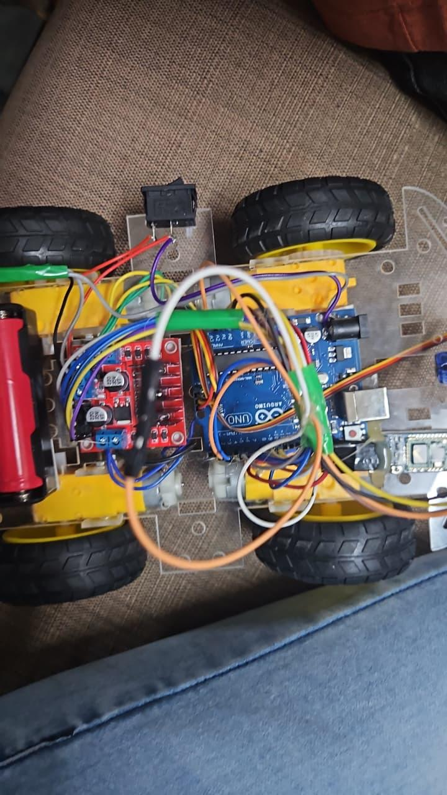

# Smart Rover: A Multi-Function Robotic Car

An autonomous and wirelessly controlled mobile robot car based on Arduino Uno, featuring four versatile operational modes: **Obstacle Avoiding**, **Bluetooth Telemetry**, **Serial Terminal Control**, and **Voice Command Navigation**.



---

## 📌 Project Overview

Traditional robotic cars typically operate using a single static control method. The **Smart Rover** unifies autonomous environmental perception and interactive wireless control onto a single Arduino platform, enabling real-time switching between four distinct operation modes:
1. **Obstacle Avoiding Mode**: Completely autonomous navigation using the HC-SR04 ultrasonic distance sensor. Detects barriers within 20 cm, halts, reverses, and executes collision avoidance turns.
2. **Bluetooth Control Mode**: Smartphone app-driven remote control over HC-05/HC-06 RF serial link.
3. **Serial Terminal Control Mode**: Accepts interactive movement instructions from a serial terminal via USB / PC interface.
4. **Voice Control Mode**: Interprets spoken voice commands (Forward, Backward, Left, Right, Stop) translated via speech recognition mobile apps into wireless UART commands.

---

## ⚙️ Hardware Specifications & Bill of Materials

| Component | Function / Role | Interface / Connection |
|---|---|---|
| **Arduino Uno (ATmega328P)** | Central control unit & mode state machine | Main MCU |
| **HC-SR04 Ultrasonic Sensor** | Autonomous distance detection (2 cm – 400 cm) | Digital Pins `D9` (Trig), `D10` (Echo) |
| **L298N Dual H-Bridge Driver** | Bidirectional DC motor speed and direction driver | Digital Pins `D5`, `D6`, `D7`, `D8` |
| **HC-05 / HC-06 Bluetooth Module** | Wireless telemetry & mobile app serial interface | Hardware Serial / UART (`D0` RX, `D1` TX) |
| **4x TT Geared DC Motors** | 4-wheel drive mechanical locomotion | L298N Terminal blocks (OUT1–OUT4) |
| **Rechargeable Battery Pack** | 7.4V – 12V DC power delivery | L298N 12V/GND terminals with 5V step-down to Arduino |
| **4WD Robot Chassis Kit** | Mechanical platform, wheels & mounting standoffs | Integrated chassis |

---

## 🏗️ Hardware Architecture & Pin Mapping

```
                 +-----------------------+
                 |      Arduino Uno      |
                 +-----------+-----------+
                             |
         +-------------------+-------------------+
         |                   |                   |
   [HC-SR04 Sensor]    [HC-05 Bluetooth]   [L298N Motor Driver]
   Trig  -> Pin 9      TX -> Pin 0 (RX)    IN1 -> Pin 5 (Left Forward)
   Echo  -> Pin 10     RX -> Pin 1 (TX)    IN2 -> Pin 6 (Left Backward)
   VCC   -> 5V         VCC-> 5V            IN3 -> Pin 7 (Right Forward)
   GND   -> GND        GND-> GND           IN4 -> Pin 8 (Right Backward)
                                                 |
                                         [4x Geared DC Motors]
```

---

## 💻 Control Commands

| Character | Command / Voice Action | Rover Action |
|:---:|:---:|:---|
| `'O'` | Autonomous Mode | Switch to Obstacle Avoidance mode |
| `'M'` | Bluetooth Mode | Switch to Manual Smartphone mode |
| `'T'` | Terminal Mode | Switch to Serial Terminal mode |
| `'V'` | Voice Mode | Switch to Voice Recognition mode |
| `'F'` | Forward ("Forward") | Drive forward |
| `'B'` | Backward ("Backward") | Drive backward / reverse |
| `'L'` | Left ("Left") | Counter-rotate left |
| `'R'` | Right ("Right") | Counter-rotate right |
| `'S'` | Stop ("Stop") | Full stop |

---

## 📄 Documentation

The complete course project submission report is available in the [`docs/`](docs/) directory:
- [Smart_Rover_Final_Report.pdf](docs/Smart_Rover_Final_Report.pdf) — Comprehensive study covering problem statement, system methodology, circuit diagrams, testing results, and future scope.

---

## 🚀 Getting Started

1. Clone this repository:
   ```bash
   git clone https://github.com/AzaanGIT/smart-rover-multi-function-car.git
   ```
2. Open `src/SmartRover_Firmware.ino` in the Arduino IDE.
3. Select Board: **Arduino Uno** and your target COM/Serial Port.
4. Upload firmware to the Arduino board (disconnect HC-05 RX/TX momentarily during flashing).
5. Open Serial Monitor (9600 Baud) or pair your phone with HC-05 to drive the rover.
